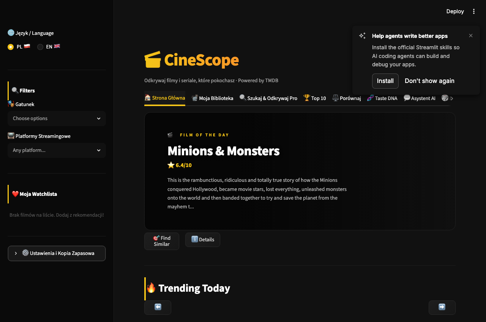
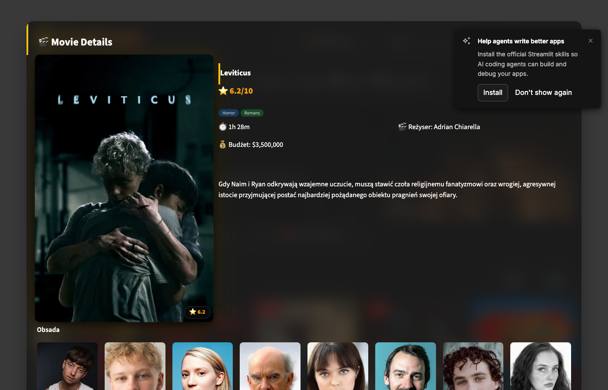
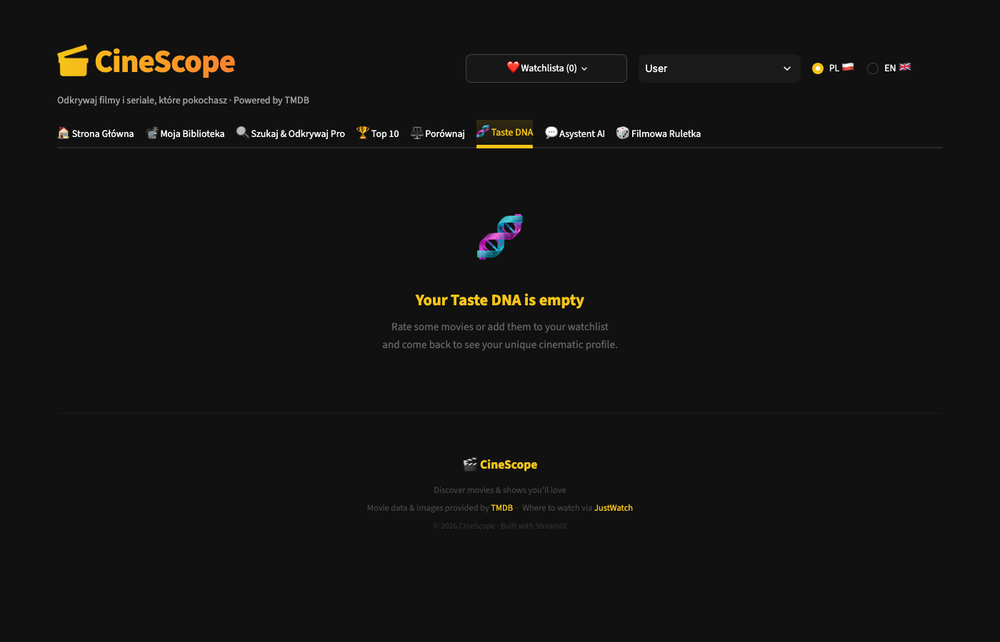
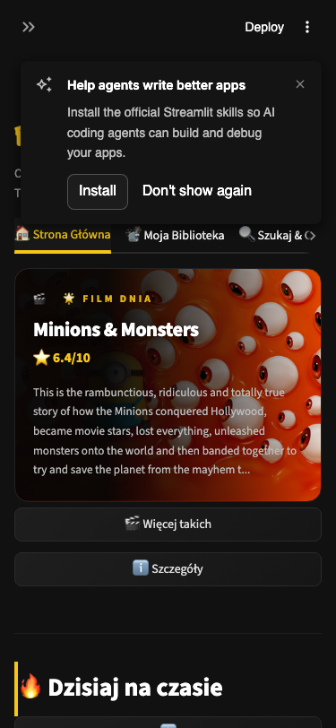
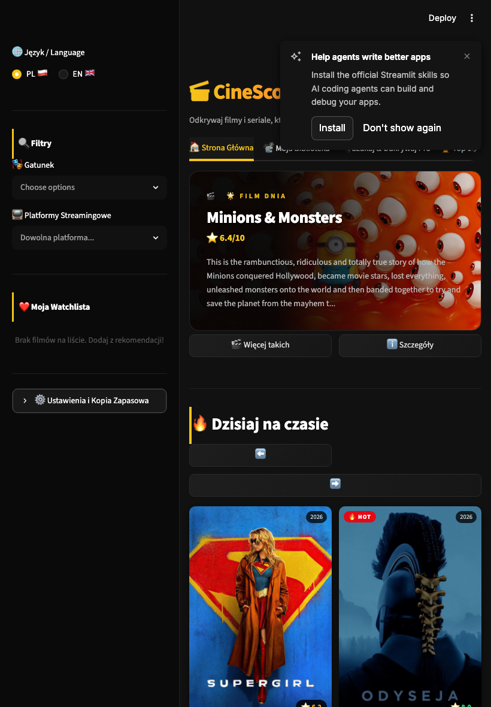

# 🎬 CineScope — Movie & TV Discovery App

> Discover movies and shows you'll love, powered by TMDB.

**Live Demo → [cinescope.streamlit.app](https://movie-recommender-j39lcqbuavwn7ndlblqytc.streamlit.app/)**

[](https://github.com/krzysztofrasala/movie-recommender/actions/workflows/ci.yml)
[](https://www.python.org/downloads/)
[](https://streamlit.io/)
[](https://github.com/astral-sh/ruff)

---

## ✨ Features

### 🏠 Home
- **Film of the Day** — a featured movie every day with a cinematic backdrop banner
- **Now Playing in Cinemas** — live data of what's currently in theatres
- **Trending Today** — the 20 most popular movies right now, paginated (5 at a time)
- **Recommended For You** — personalized picks based on your star ratings

### 🔍 Discovery
- **My Library** — search 5,000+ movies with text filter, genre & year sliders
- **Virtual Assistant** — chat with an AI assistant to get personalized movie recommendations via natural language
- **Mood Picker** — one click to get Comedy / Horror / Action / Romance / Sci-Fi / Thriller / Drama / Animation picks
- **Browse by Decade** — 1980s · 1990s · 2000s · 2010s · 2020s
- **🎲 Surprise Me** — instant random recommendation from your active filters
- **Search All Movies & TV (TMDB)** — search the entire TMDB database, not just the local library
- **TV Show support** — search, details, and similar show recommendations for series
- **Search by Actor or Director** — find a person and browse their full filmography

### 🎯 Recommendations
- **Content-Based Filtering** — NLP-powered similarity using genres, cast, crew and keywords
- **TMDB Collaborative Recommendations** — fallback for movies outside the local dataset
- **More Like This** — on every trending and now-playing card
- **🏆 Top 10** — most popular and top-rated charts with ranked cards

### 🎬 Movie & TV Details
- Full modal with poster, tagline, runtime, budget, genres
- **Cast photos** — profile pictures with character names for up to 8 actors
- Embedded YouTube trailer
- Color-coded rating badge (green / orange / red)
- Direct link to JustWatch (streaming availability)

### ⚖️ Compare Movies
- Side-by-side comparison of any two movies
- **Content Similarity Score** — percentage match computed on demand from the movies' tag vectors
- Highlights shared director, genres, and cast members

### ❤️ Personal
- **Watchlist** — per-visitor and saved to your browser's localStorage, so it survives page reloads without any server-side storage; thumbnails in the sidebar
- **Star Ratings** — rate any recommended movie 1–5 stars
- **Search History** — one-click re-run of your last 10 searches
- **Your Stats** — watchlist count, rated movies count, average rating

### 📱 Responsive
- **Adaptive card grid** — 5 columns on desktop, 2 on tablet, 1 on mobile via CSS `flex-wrap` on Streamlit column blocks
- **Auto-collapsing sidebar** — filters slide out of the way on narrow screens so the main content is visible on first paint
- **Scalable typography** — banner heading and body scale down with media queries at 900px and 560px breakpoints

---

## 🛠️ Tech Stack

| Layer | Technology |
|---|---|
| Frontend | Streamlit 1.36+ |
| Recommendation Engine | Scikit-learn (CountVectorizer · Cosine Similarity) |
| Movie Data (live) | TMDB API |
| Movie Data (local) | ~5,000 movies (rebuilt via `fetch_dataset.py`) |
| Language | Python 3.12 |

---

## 🧠 How the Recommendation Engine Works

```
TMDB Discover API (up to 4,000 popular movies)
        │
        ▼
Tag Creation — overview + genres + keywords + cast + director
        │
        ▼
CountVectorizer — Bag of Words (5,000 features, English stop words)
        │
        ▼
Cosine Similarity → precomputed top-20 neighbours per movie (<1 MB on disk)
        │
        ▼
Top 10 most similar movies → parallel TMDB API fetch (ThreadPoolExecutor)
```

For movies **outside** the local dataset (e.g. from TMDB search or TV shows), the app falls back to TMDB's `/recommendations` endpoint which uses collaborative filtering from millions of users.

---

## ⚙️ Setup & Installation

### 1. Clone the repository
```bash
git clone https://github.com/krzysztofrasala/movie-recommender.git
cd movie-recommender
```

### 2. Create a virtual environment
```bash
python3 -m venv .venv
source .venv/bin/activate       # Windows: .venv\Scripts\activate
pip install -r requirements.txt
```

### 3. Get a TMDB API key
1. Create a free account at [themoviedb.org](https://www.themoviedb.org/)
2. Go to **Settings → API** and generate an API key (free tier is sufficient)

### 4. Add your API key
Create the file `.streamlit/secrets.toml`:
```toml
TMDB_API_KEY = "your_api_key_here"
```
> ⚠️ This file is in `.gitignore` — your key will never be committed.

### 5. Model files
The model files (`movie_dict.pkl`, `neighbors.pkl`, `vectors.npz`, `movies.csv`) are small (<3 MB total) and committed to the repository, so the app works out of the box. To rebuild them with fresh TMDB data:
```bash
TMDB_API_KEY="your_api_key_here" python fetch_dataset.py
```
This fetches up to 4,000 popular movies from TMDB and takes ~5–10 minutes depending on your connection.

### 6. Run the app
```bash
streamlit run app.py
```

### 7. Run tests and linter
```bash
pip install pytest ruff
pytest              # 60 unit tests for parsing, state, taste DNA, ...
ruff check .        # style + likely-bug lint
```

---

## 📂 Project Structure

```
movie-recommender/
├── app.py                      # Streamlit entry point (page config + layout wiring)
├── cinescope/                  # Application package
│   ├── config.py               # Constants: moods, decades, genre ids
│   ├── data.py                 # Local dataset & similarity model loading/filtering
│   ├── nl_query.py             # Natural-language query parsing (zero API cost)
│   ├── recommender.py          # Content-based recommendation logic
│   ├── state.py                # Session state, watchlist & search history
│   ├── taste.py                # Taste-DNA profiling & personas
│   ├── tmdb.py                 # TMDB API client (all HTTP in one place)
│   └── ui/
│       ├── cards.py            # Movie card / row / grid renderers
│       ├── dialogs.py          # Movie & TV detail modals
│       ├── home.py             # Home sections (film of the day, trending, ...)
│       ├── html.py             # Shared HTML snippet builders
│       ├── sidebar.py          # Filters, stats, watchlist, ratings
│       ├── styles.py           # Global CSS
│       └── tabs/               # Library, Search, Top 10, Compare, Taste DNA
│           └── assistant.py    # AI Chat interface for recommendations
├── tests/                      # pytest suite (nl_query, ui, state, taste, tmdb, data)
├── fetch_dataset.py            # Rebuilds the recommendation model from TMDB
├── requirements.txt            # Python dependencies
├── pyproject.toml              # pytest and ruff config
├── movies.csv                  # Generated by fetch_dataset.py (release dates & genres)
├── movie_dict.pkl              # Processed movie data (generated)
├── neighbors.pkl               # Top-20 similar movies per title (generated)
├── vectors.npz                 # Sparse tag vectors for pair similarity (generated)
├── docs/screenshots/           # README screenshots
├── .github/workflows/          # GitHub Actions CI (lint + tests)
└── .streamlit/
    ├── config.toml             # Streamlit theme config
    └── secrets.toml            # API keys (not committed)
```

---

## 🚀 Deploying to Streamlit Cloud

1. Push your code to GitHub (the model files are small and already committed; `secrets.toml` stays local)
2. Go to [share.streamlit.io](https://share.streamlit.io/) and connect your repo
3. In **App settings → Secrets**, add:
```toml
TMDB_API_KEY = "your_api_key_here"
```

---

## 📸 Screenshots

### Film of the Day
Every day a different movie takes over the top of the page with a cinematic backdrop banner.


### Recommendations
Ten content-based picks in a 2×5 grid — genre chips, streaming-provider logos and star ratings on every card.



### Movie Details
A full modal with tagline, cast photos, embedded trailer and a direct JustWatch link.



### Taste DNA
Genre radar and era-preference chart built from your ratings — plus a matching "movie persona" for fun.



### Responsive on phone and tablet
Card grids reflow from 5-across on desktop to 2-across on tablet and 1-across on mobile. The sidebar auto-collapses on narrow viewports so the main content is visible on first paint, and the movie details modal resizes to fit small screens.

<p align="center">
  
  &nbsp;&nbsp;
  
</p>

---

## 📄 License

Released under the [MIT License](LICENSE) — feel free to fork, modify and build on top of this project.

---

*Data provided by [TMDB](https://www.themoviedb.org) · Streaming info via [JustWatch](https://www.justwatch.com)*
